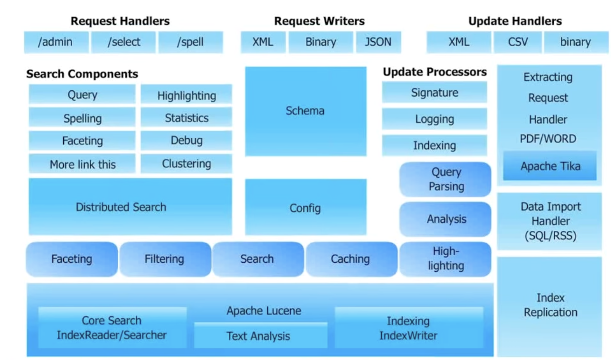
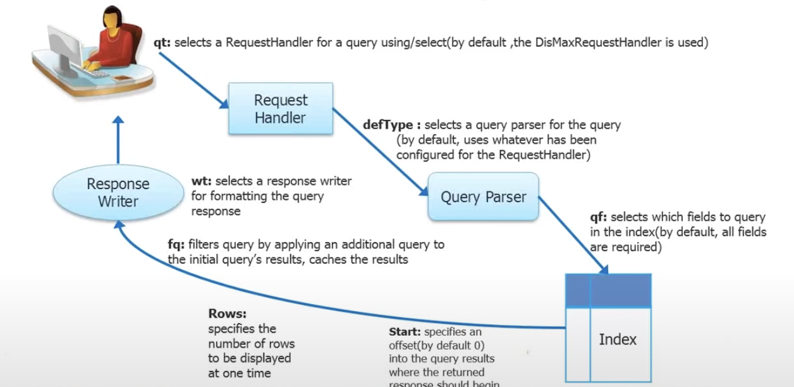

# Solr Tutorial
## Solr Architecture and Search Process

### Indexing Data
> A Solr index can accept data from many different sources, including XML, CSV, data extracted from tables in database and fiels in common file formats such as Microsoft Word or PDFs

Here are the few most common ways of loadin gdata into a Solr index:
1. Indexing with Solr Cell and Apache Tika
2. Uploading XML files by sending HTTP requests to the Solr server from any environment
3. Writing custom Java application to ingest data through Solr’s Java Client API

### Solr: Analysis
1. There are three main concepts in analysis: analyzers, tokenizers, and filters
- **Analyzers** are used both during, when a document is indexed, and at query time
- **Tokenizers** break field data into lexical units, or tokens
- **Filters** examine a stream of tokens and keep them, transform or discard them, or create new ones 
2. All those things could be pre-defiend in your `solrconfig.xml`  file

#### Configuring Solr Instances / Cores
> Solr configurations are compsoed of 4 main files: `solrconfig.xml`, `solr.xml`, `core.properties`, and `schema.xml`
1. `solrconfig.xml` handles the configuring all the indexing and searching components
2. `solr.xml` is a global level file that defines how many cores are there, what are their namaes, and all the relevant details
3. `core.properties` define some properties at the core level 
4. `schema.xml` is at the core data structure level in which you can define the field type

## TODO
Finishing the rest of the [tutorial](https://www.youtube.com/watch?v=7WIbU3ZlTe4&list=PL9ooVrP1hQOFFnF_1Cmi0t8aJLqMg0Wtx&index=1)